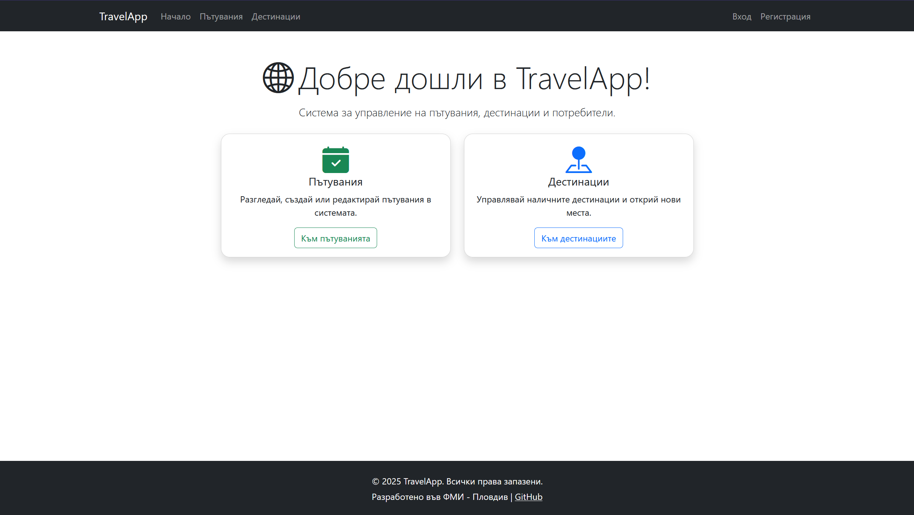
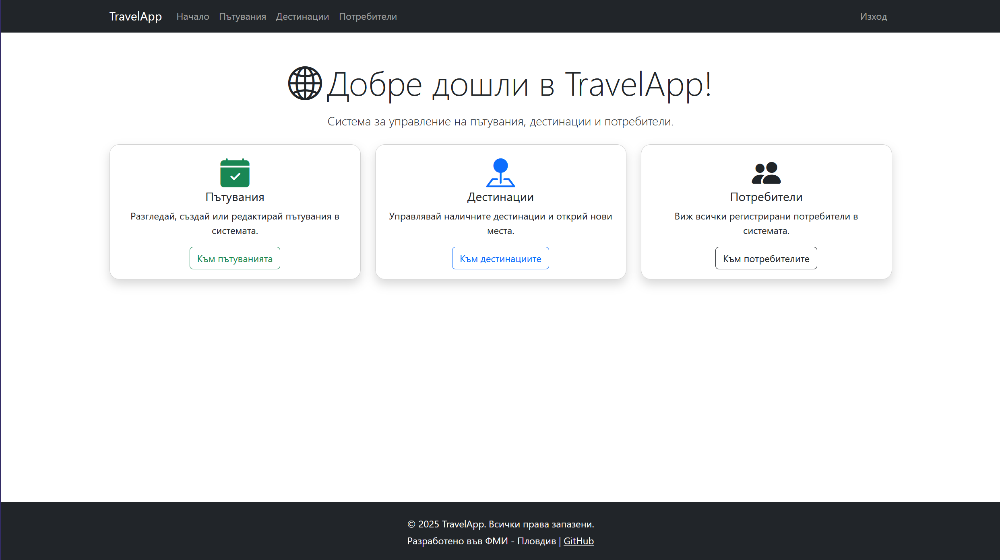
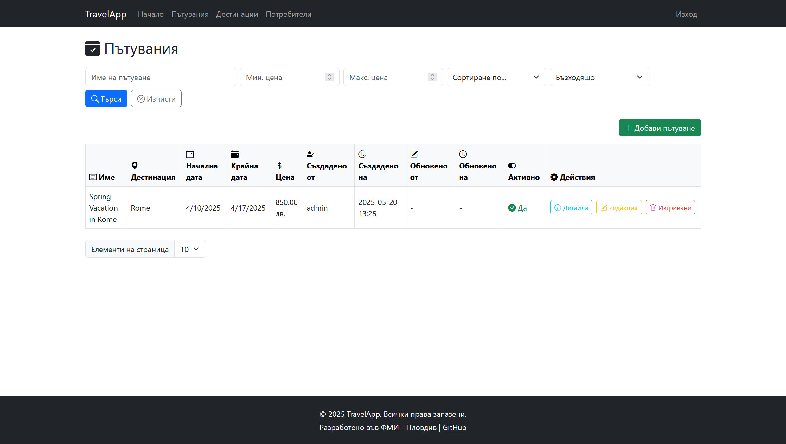
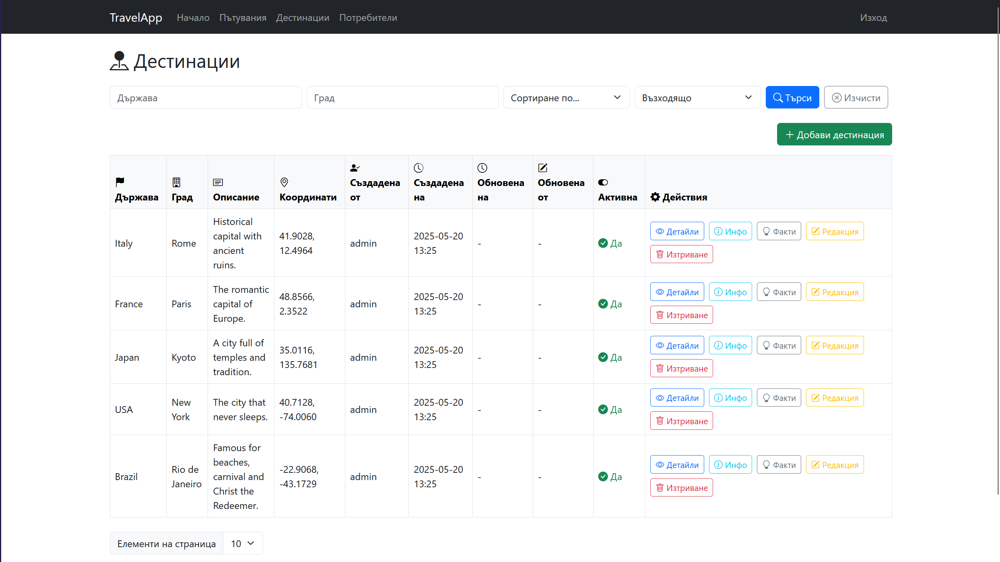
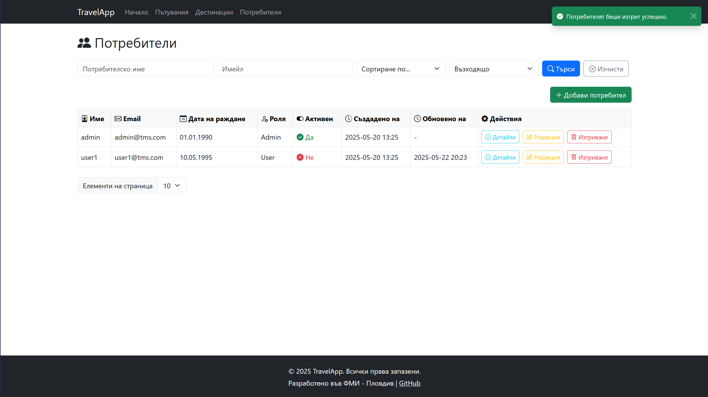
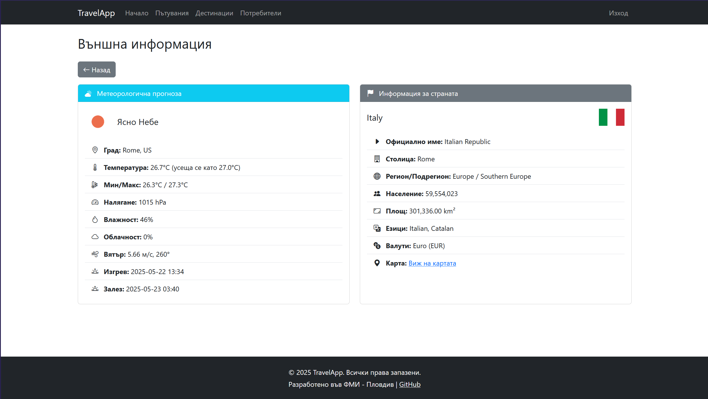
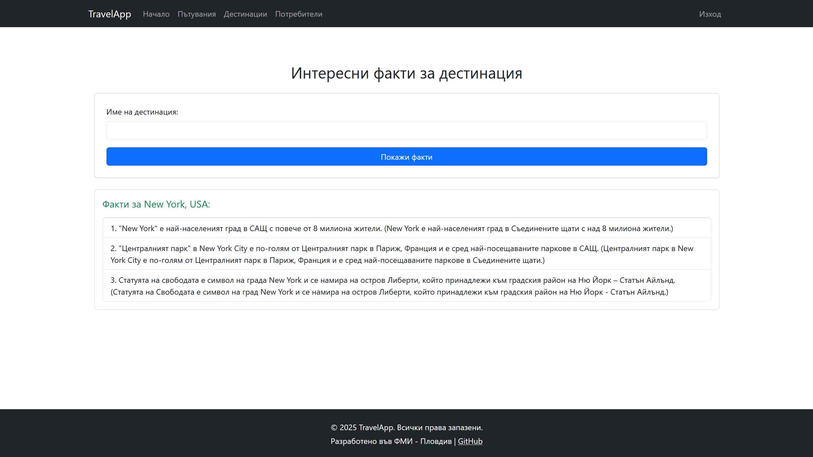

# 🌍 Система за управление на пътувания (Travel Management System)

## 👨‍🎓 Информация за автора
**Име:** Атанас Гюлчев <br />
**Факултетен номер:** 2301321018 <br />
**Специалност:** Софтуерно инженерство <br />
**Учебна година:** 2024/2025 <br />

## 📋 Подробно описание на проекта

Системата за управление на пътувания е цялостно REST API приложение, разработено с ASP.NET Core, което предоставя пълен набор от функционалности, необходими за организация и управление на туристически услуги. Проектът демонстрира най-добрите практики в .NET разработката, включително чиста архитектура, модерни библиотеки и инструменти, и строго типизиран език.

### 🎯 Основна цел на системата:

- Разглеждане и управление на информация за туристически дестинации
- Планиране и управление на пътувания към тези дестинации
- Получаване на актуална информация за държави и прогнози за времето
- Поддържане на различни нива на достъп (администратор/потребител)

Приложението отговаря на съвременните изисквания за сигурност, разширяемост, лесна поддръжка и висока производителност, като същевременно демонстрира знания по проектиране и имплементация на API-базирани решения с ASP.NET Core.

## 💻 Детайлен технологичен стек

### Backend

- **Framework**: ASP.NET Core 8.0 - най-новата версия на кросплатформената рамка на Microsoft за разработка на високопроизводителни уеб приложения
- **Език**: C# 12 - обектно-ориентиран език с богати възможности за функционално програмиране
- **Database**: Microsoft SQL Server - релационна база данни с висока производителност
- **ORM**: Entity Framework Core 9.0.4 - мощен object-relational mapper с поддръжка на Code-First подход
- **API стил**: RESTful с поддръжка на различни HTTP методи (GET, POST, PUT, PATCH, DELETE)

### Автентикация и сигурност

- **JWT** (JSON Web Tokens): За сигурна, базирана на токени автентикация
- **HTTPS**: Поддръжка за криптирана комуникация
- **Role-Based Access Control (RBAC)**: Разделяне на права според ролите (Admin/User)
- **Password Hashing**: SHA-256 хеширане на пароли за допълнителна сигурност

### Библиотеки и инструменти

- **AutoMapper 14.0.0**: За лесно преобразуване между обектни модели
- **FluentValidation 11.11.0**: За валидация на входните данни
- **Swagger/OpenAPI 6.9.0**: За автоматично генериране на API документация
- **X.PagedList 8.4.7**: За имплементация на пагинация
- **Newtonsoft.Json**: За работа с JSON данни
- **Microsoft.AspNetCore.JsonPatch**: За поддръжка на JSON Patch операции
- **System.Linq.Dynamic.Core 1.6.2**: За динамично изграждане на LINQ заявки

### Интеграции с външни API

- **OpenWeatherMap API**: За извличане на метеорологична информация
- **REST Countries API**: За извличане на данни за държави

### Инструменти за разработка

- **Entity Framework Core Tools**: За управление на миграции на базата данни
- **Swagger UI**: За тестване на API ендпоинтите

## 🏗️ Подробна архитектура на проекта

Проектът е структуриран според принципите на чистата архитектура (Clean Architecture), което осигурява разделяне на отговорностите, независимост на слоевете, лесно тестване и скалируемост. Всеки слой има конкретна отговорност и зависи само от вътрешните слоеве.

### Слоева структура

#### 1. TravelManagementSystem.API

Външният слой, който отговаря за взаимодействието с външния свят чрез HTTP протокола.

**Основни компоненти**:

- **Controllers**: Обработват входящите HTTP заявки, валидират ги и ги предават към съответните услуги
  - `AuthenticationController`: Отговаря за регистрация и вход в системата
  - `UsersController`: Управление на потребители (достъпно само за администратори)
  - `DestinationsController`: Управление на туристически дестинации
  - `TripsController`: Управление на пътувания
  - `ExternalController`: Интеграция с външни API услуги
  - `GenericController<T>`: Базов контролер, който предоставя CRUD операции за наследяващите контролери

- **Middleware**:
  - `CustomAuthorizationMiddlewareResultHandler`: Персонализира отговорите при неуспешна авторизация

- **Program.cs**: Конфигурация на приложението, включително:
  - Конфигурация на база данни
  - Регистрация на услуги (Dependency Injection)
  - Конфигурация на JWT автентикация
  - Конфигурация на Swagger
  - Конфигурация на валидатори
  - Конфигурация на AutoMapper
  - Конфигурация на HTTP клиенти за външни API

- **OpenApi**: Документация на API в YAML формат

#### 2. TravelManagementSystem.Application

Слой за бизнес логика и приложен слой, който съдържа всички бизнес правила и услуги.

**Основни компоненти**:

- **DTOs** (Data Transfer Objects):
  - `Authentication`: DTO за регистрация и вход
  - `Destinations`: DTO за дестинации (създаване, преглед, обновяване)
  - `Trips`: DTO за пътувания (създаване, преглед, обновяване)
  - `Users`: DTO за потребители (създаване, преглед, обновяване)
  - `External`: DTO за външни API услуги (държави, времето)

- **Profiles**: AutoMapper профили за конвертиране между entites и DTOs
- **Parameters**: Класове за параметри на заявки (пагинация, филтриране, сортиране)
- **Services**: Интерфейси на услуги
  - `IGenericService<T>`: Базов интерфейс за услуги с CRUD операции
  - `IAuthenticationService`: Услуга за автентикация
  - `IExternalApiService`: Услуга за интеграция с външни API

- **Validators**: FluentValidation валидатори за DTO обектите
- **Wrappers**: Обвиващи класове за API отговори
  - `ApiResponse<T>`: Обвиващ клас за API отговори
  - `PagedResponse<T>`: Обвиващ клас за пагинирани отговори

- **Helpers**: Помощни класове
  - `PasswordHelper`: Хеширане на пароли
  - `DateTimeHelper`: Конвертиране на Unix timestamp

- **Models**: Модели за външни API отговори

#### 3. TravelManagementSystem.Domain

Слой за домейн модели и бизнес обекти. Съдържа основните entites и интерфейси на репозитории.

**Основни компоненти**:

- **Entities**:
  - `User`: Потребител на системата
  - `Destination`: Туристическа дестинация
  - `Trip`: Пътуване

- **Common**: Базови класове
  - `BaseEntity`: Базов клас за всички entites
  - `AuditableEntity`: Разширява BaseEntity с информация за създаване и обновяване

- **Repositories**: Интерфейси на репозитории
  - `IGenericRepository<T>`: Базов интерфейс за репозитории
  - `IUserRepository`: Специфичен репозиторий за работа с потребители

#### 4. TravelManagementSystem.Infrastructure

Слой за имплементация на външните зависимости и достъп до източници на данни.

**Основни компоненти**:

- **Persistence**: Класове за достъп до базата данни
  - `ApplicationDbContext`: Контекст на базата данни

- **Repositories**: Имплементации на репозитории
  - `GenericRepository<T>`: Имплементация на IGenericRepository<T>
  - `UserRepository`: Имплементация на IUserRepository

- **Services**: Имплементации на услуги
  - `GenericService<T>`: Имплементация на IGenericService<T>
  - `AuthenticationService`: Имплементация на IAuthenticationService
  - `ExternalApiService`: Имплементация на IExternalApiService

- **Configurations**: Конфигурации на Entity Framework
  - `BaseEntityConfiguration<T>`: Базова конфигурация за всички entites
  - `AuditableEntityConfiguration<T>`: Конфигурация за одитируеми entites
  - `UserConfiguration`: Конфигурация за User entity
  - `DestinationConfiguration`: Конфигурация за Destination entity
  - `TripConfiguration`: Конфигурация за Trip entity

- **Extensions**: Разширения за класове
  - `HttpContextExtensions`: Разширения за HttpContext
  - `QueryableExtensions`: Разширения за IQueryable

- **Migrations**: EF Core миграции на базата данни
- **Seeding**: Класове за инициализация на данни

#### 5. TravelManagementSystem.Shared

Слой за споделени ресурси и константи между проектите.

**Основни компоненти**:

- **Constants**: Константи, използвани в цялото приложение
  - `ApplicationConstants`: Константи за пагинация и други общи настройки

### 🔄 Комуникация между слоевете

- **API слоят** зависи от Application и използва неговите интерфейси и DTO обекти
- **Application слоят** зависи от Domain и дефинира интерфейси, които се имплементират от Infrastructure
- **Domain слоят** е независим от другите слоеве и съдържа core бизнес обекти
- **Infrastructure слоят** зависи от Application и Domain и предоставя конкретни имплементации
- **Shared слоят** се използва от всички слоеве

### 💉 Dependency Injection

Приложението използва вградения контейнер за Dependency Injection в ASP.NET Core за регистрация и инжектиране на зависимостите. Това осигурява слабо свързване между компонентите и улеснява тестването.

### 📦 Repository Pattern

Имплементиран е Repository Pattern, който абстрахира достъпа до данни и позволява лесна смяна на източника на данни (например от SQL Server към друга база данни).

### 🔄 Unit of Work Pattern

Entity Framework Core се използва като единица за работа (Unit of Work), която координира работата с различни репозитории и гарантира атомичност на операциите.

## 🛠️ Детайлни функционалности на системата

### 1. Система за автентикация и оторизация

#### Регистрация на потребители

- Потребителите могат да се регистрират, като предоставят потребителско име, имейл, парола, дата на раждане и телефонен номер
- Системата валидира всички входни данни, проверява за уникалност на потребителското име и имейл
- При успешна регистрация, паролата се хешира с SHA-256 алгоритъм
- Новорегистрираните потребители автоматично получават роля "User"
- След успешна регистрация, системата връща JWT токен за достъп

#### Вход в системата

- Потребителите могат да влязат в системата с потребителско име и парола
- Системата проверява дали потребителското име съществува и дали паролата съвпада
- При успешен вход, системата връща JWT токен за достъп

#### JWT автентикация

- Токените са валидни 2 часа след издаване
- Съдържат claims за идентификатор на потребителя, потребителско име и роля
- Използват се за всички защитени ендпоинти

#### Оторизация базирана на роли

- Системата поддържа две роли: "Admin" и "User"
- Потребителите с роля "Admin" имат достъп до всички API ендпоинти
- Потребителите с роля "User" имат достъп само до своите ресурси и публичните ендпоинти
- Управлението на потребителски акаунти е достъпно само за администратори

#### Персонализирани отговори при неуспешна автентикация

- Системата връща подробни и локализирани съобщения при неуспешна автентикация
- Различни отговори за "Unauthorized" (401) и "Forbidden" (403) статус

### 2. Управление на потребителски акаунти (само за администратори)

#### Извличане на списък с потребители

- Поддръжка на пагинация (страница, размер на страница)
- Филтриране по потребителско име и имейл
- Сортиране по различни полета (възходящо/низходящо)
- Връщане на метаданни за пагинация (общ брой, страници, навигация)

#### Извличане на потребител по ID

- Детайлен преглед на конкретен потребителски акаунт
- Включва всички полета, с изключение на паролата

#### Създаване на нов потребител

- Администраторите могат да създават нови потребители
- Пълен контрол върху всички полета, включително ролята

#### Обновяване на потребител

- Пълно обновяване на потребителски акаунт
- Обновяване на парола (паролата се хешира отново)

#### Частично обновяване на потребител (PATCH)

- Поддръжка на JSON Patch операции (add, remove, replace, copy, move, test)
- Възможност за обновяване само на конкретни полета

#### Изтриване на потребител

- Системата използва "soft delete" - записът се маркира като неактивен, но не се изтрива физически
- Неактивните потребители не могат да влязат в системата

### 3. Управление на дестинации

#### Извличане на списък с дестинации

- Поддръжка на пагинация (страница, размер на страница)
- Филтриране по държава и/или град
- Сортиране по различни полета (възходящо/низходящо)
- Връщане на метаданни за пагинация

#### Извличане на дестинация по ID

- Детайлен преглед на конкретна дестинация
- Включва информация за държава, град, описание, географски координати

#### Създаване на нова дестинация

- Създаване на нова туристическа дестинация с подробна информация
- Автоматично записване на създателя и времето на създаване
- Валидация на географски координати и други полета

#### Обновяване на дестинация

- Пълно обновяване на съществуваща дестинация
- Автоматично записване на потребителя, извършил обновяването

#### Частично обновяване на дестинация (PATCH)

- Поддръжка на JSON Patch операции
- Възможност за обновяване само на конкретни полета

#### Изтриване на дестинация

- Soft delete функционалност
- Проверка за свързани пътувания

### 4. Управление на пътувания

#### Извличане на списък с пътувания

- Поддръжка на пагинация (страница, размер на страница)
- Филтриране по заглавие и ценови диапазон (минимална/максимална цена)
- Сортиране по различни полета (възходящо/низходящо)
- Връщане на метаданни за пагинация

#### Извличане на пътуване по ID

- Детайлен преглед на конкретно пътуване
- Включва информация за дестинация, период, цена и други детайли

#### Създаване на ново пътуване

- Създаване на ново пътуване към съществуваща дестинация
- Автоматично записване на създателя и времето на създаване
- Валидация на периода (начална дата преди крайна дата)
- Валидация на цената (положителна стойност)

#### Обновяване на пътуване

- Пълно обновяване на съществуващо пътуване
- Автоматично записване на потребителя, извършил обновяването

#### Частично обновяване на пътуване (PATCH)

- Поддръжка на JSON Patch операции
- Възможност за обновяване само на конкретни полета

#### Изтриване на пътуване

- Soft delete функционалност

### 5. Интеграция с външни API услуги

#### Извличане на информация за държава

- Интеграция с REST Countries API
- Извличане на подробна информация за държава по име
- Данни включват: официално име, столица, население, площ, регион, флаг, езици, валути

#### Извличане на прогноза за времето

- Интеграция с OpenWeatherMap API
- Извличане на текуща прогноза за времето за конкретен град
- Данни включват: температура, влажност, налягане, вятър, облачност, време на изгрев/залез

### 6. Обща функционалност

#### Одитиране

- Системата автоматично записва кой и кога е създал всеки запис
- Системата автоматично записва кой и кога е обновил всеки запис

#### Валидация

- Подробна валидация на всички входни данни с FluentValidation
- Връщане на конкретни съобщения за грешки

#### Пагинация

- Всички списъчни заявки поддържат пагинация
- Настройваем размер на страница (по подразбиране: 10, максимум: 100)
- Метаданни за пагинация (текуща страница, общ брой, навигация)

#### Филтриране

- Поддръжка на разнообразни филтри за всеки тип ресурс
- Гъвкава филтрираща логика с поддръжка на частично съвпадение за низове

#### Сортиране

- Сортиране по произволно поле
- Възходящо или низходящо сортиране

#### Стандартизирани API отговори

- Всички API отговори следват един и същ формат
- Полета success, message, data и errors
- HTTP статус кодове, съответстващи на операцията

# Подробни API Endpoints с параметри и примери

## Автентикация

### Регистрация на нов потребител
- **URL**: `POST /api/Authentication/register`
- **Достъп**: Публичен
- **Описание**: Регистрира нов потребител в системата
- **Тяло на заявката**:
  ```json
  {
    "username": "mariageorgieva",
    "email": "maria.georgieva@example.com",
    "password": "Secret456!",
    "dateOfBirth": "1992-08-20T00:00:00Z",
    "phoneNumber": "+359889876543"
  }
  ```
- **Успешен отговор** (200 OK):
  ```json
  {
    "success": true,
    "message": "Потребителят беше регистриран успешно. Добре дошли в системата за управление на пътувания!",
    "data": "eyJhbGciOiJIUzI1NiIsInR5cCI6IkpXVCJ9...",
    "errors": null
  }
  ```
- **Грешка** (400 Bad Request):
  ```json
  {
    "success": false,
    "message": "Неуспешна регистрация. Моля, проверете въведените данни и опитайте отново.",
    "data": null,
    "errors": {
      "Username": ["Потребителското име вече съществува."]
    }
  }
  ```

### Влизане в системата
- **URL**: `POST /api/Authentication/login`
- **Достъп**: Публичен
- **Описание**: Автентикира потребител и връща JWT токен
- **Тяло на заявката**:
  ```json
  {
    "username": "mariageorgieva",
    "password": "Secret456!"
  }
  ```
- **Успешен отговор** (200 OK):
  ```json
  {
    "success": true,
    "message": "Успешно влизане в системата. Добре дошли отново!",
    "data": "eyJhbGciOiJIUzI1NiIsInR5cCI6IkpXVCJ9...",
    "errors": null
  }
  ```
- **Грешка** (400 Bad Request):
  ```json
  {
    "success": false,
    "message": "Неуспешно влизане. Моля, проверете въведените данни.",
    "data": null,
    "errors": {
      "General": ["Невалидно потребителско име или парола."]
    }
  }
  ```

## Потребители (достъпно само за администратори)

### Извличане на всички потребители с пагинация и филтриране
- **URL**: `GET /api/Users`
- **Автентикация**: JWT (Admin роля)
- **Описание**: Извлича списък с потребители с възможности за филтриране и пагинация
- **Параметри**:
  - `Username` (query, опционален): Филтър по потребителско име
  - `Email` (query, опционален): Филтър по имейл
  - `Page` (query, опционален): Номер на страницата (по подразбиране: 1)
  - `PageSize` (query, опционален): Брой записи на страница (по подразбиране: 10, максимум: 100)
  - `OrderBy` (query, опционален): Поле за сортиране (например Username, Email, CreatedOn)
  - `IsDescending` (query, опционален): Низходящо сортиране (по подразбиране: false)
- **Успешен отговор** (200 OK):
  ```json
  {
    "success": true,
    "message": "Данните са извлечени успешно.",
    "errors": null,
    "pageNumber": 1,
    "pageSize": 10,
    "totalItemCount": 2,
    "pageCount": 1,
    "hasPreviousPage": false,
    "hasNextPage": false,
    "isFirstPage": true,
    "isLastPage": true,
    "data": [
      {
        "id": 1,
        "username": "admin",
        "email": "admin@tms.com",
        "role": "Admin",
        "dateOfBirth": "1990-01-01T00:00:00Z",
        "phoneNumber": "0888123456",
        "isActive": true,
        "createdOn": "2025-05-20T13:24:01Z",
        "updatedOn": null
      },
      {
        "id": 2,
        "username": "user1",
        "email": "user1@tms.com",
        "role": "User",
        "dateOfBirth": "1995-05-10T00:00:00Z",
        "phoneNumber": "0888123457",
        "isActive": true,
        "createdOn": "2025-05-20T13:24:01Z",
        "updatedOn": null
      }
    ]
  }
  ```
- **Грешка** (401 Unauthorized):
  ```json
  {
    "success": false,
    "message": "Достъпът е отказан",
    "data": null,
    "errors": {
      "Unauthorized": ["Не сте влезли в системата."]
    }
  }
  ```
- **Грешка** (403 Forbidden):
  ```json
  {
    "success": false,
    "message": "Достъпът е отказан",
    "data": null,
    "errors": {
      "Forbidden": ["Нямате достъп до този ресурс."]
    }
  }
  ```

### Извличане на потребител по ID
- **URL**: `GET /api/Users/{id}`
- **Автентикация**: JWT (Admin роля)
- **Описание**: Връща детайлна информация за конкретен потребител
- **Параметри**:
  - `id` (path, задължителен): Идентификатор на потребителя
- **Успешен отговор** (200 OK):
  ```json
  {
    "success": true,
    "message": "Данните са извлечени успешно.",
    "data": {
      "id": 1,
      "username": "admin",
      "email": "admin@tms.com",
      "role": "Admin",
      "dateOfBirth": "1990-01-01T00:00:00Z",
      "phoneNumber": "0888123456",
      "isActive": true,
      "createdOn": "2025-05-20T13:24:01Z",
      "updatedOn": null
    },
    "errors": null
  }
  ```
- **Грешка** (404 Not Found):
  ```json
  {
    "success": false,
    "message": null,
    "data": null,
    "errors": {
      "General": ["Записът не е намерен."]
    }
  }
  ```

### Създаване на нов потребител
- **URL**: `POST /api/Users`
- **Автентикация**: JWT (Admin роля)
- **Описание**: Създава нов потребителски акаунт в системата
- **Тяло на заявката**:
  ```json
  {
    "username": "petardimitrov",
    "email": "petar.dimitrov@example.com",
    "password": "P@ssw0rd123",
    "role": "User",
    "dateOfBirth": "1988-03-15T00:00:00Z",
    "phoneNumber": "+359887654321"
  }
  ```
- **Успешен отговор** (201 Created):
  ```json
  {
    "success": true,
    "message": "Записът е създаден успешно.",
    "data": {
      "id": 3,
      "username": "petardimitrov",
      "email": "petar.dimitrov@example.com",
      "role": "User",
      "dateOfBirth": "1988-03-15T00:00:00Z",
      "phoneNumber": "+359887654321",
      "isActive": true,
      "createdOn": "2025-05-21T15:30:00Z",
      "updatedOn": null
    },
    "errors": null
  }
  ```
- **Грешка** (400 Bad Request):
  ```json
  {
    "success": false,
    "message": "Грешка при валидация.",
    "data": null,
    "errors": {
      "Username": ["Потребителското име вече съществува."],
      "Email": ["Имейлът вече съществува."]
    }
  }
  ```

### Обновяване на потребител
- **URL**: `PUT /api/Users/{id}`
- **Автентикация**: JWT (Admin роля)
- **Описание**: Обновява всички данни за съществуващ потребител
- **Параметри**:
  - `id` (path, задължителен): Идентификатор на потребителя
- **Тяло на заявката**:
  ```json
  {
    "username": "petardimitrov2",
    "email": "petar.dimitrov2@example.com",
    "password": "NewP@ssw0rd123",
    "role": "Admin",
    "dateOfBirth": "1988-03-15T00:00:00Z",
    "phoneNumber": "+359887654322"
  }
  ```
- **Успешен отговор** (200 OK):
  ```json
  {
    "success": true,
    "message": "Записът е обновен успешно.",
    "data": {
      "id": 3,
      "username": "petardimitrov2",
      "email": "petar.dimitrov2@example.com",
      "role": "Admin",
      "dateOfBirth": "1988-03-15T00:00:00Z",
      "phoneNumber": "+359887654322",
      "isActive": true,
      "createdOn": "2025-05-21T15:30:00Z",
      "updatedOn": "2025-05-21T15:35:00Z"
    },
    "errors": null
  }
  ```
- **Грешка** (404 Not Found):
  ```json
  {
    "success": false,
    "message": null,
    "data": null,
    "errors": {
      "General": ["Записът не е намерен за обновяване."]
    }
  }
  ```

### Частично обновяване на потребител (PATCH)
- **URL**: `PATCH /api/Users/{id}`
- **Автентикация**: JWT (Admin роля)
- **Описание**: Извършва частично обновяване на потребител чрез JSON Patch
- **Параметри**:
  - `id` (path, задължителен): Идентификатор на потребителя
- **Тяло на заявката** (JSON Patch):
  ```json
  [
    {
      "op": "replace",
      "path": "/username",
      "value": "petardimitrov_updated"
    },
    {
      "op": "replace",
      "path": "/email",
      "value": "petar.dimitrov_updated@example.com"
    }
  ]
  ```
- **Успешен отговор** (200 OK):
  ```json
  {
    "success": true,
    "message": "Записът е частично обновен успешно.",
    "data": {
      "id": 3,
      "username": "petardimitrov_updated",
      "email": "petar.dimitrov_updated@example.com",
      "role": "Admin",
      "dateOfBirth": "1988-03-15T00:00:00Z",
      "phoneNumber": "+359887654322",
      "isActive": true,
      "createdOn": "2025-05-21T15:30:00Z",
      "updatedOn": "2025-05-21T15:40:00Z"
    },
    "errors": null
  }
  ```
- **Грешка** (404 Not Found):
  ```json
  {
    "success": false,
    "message": null,
    "data": null,
    "errors": {
      "General": ["Записът не е намерен за частично обновяване."]
    }
  }
  ```

### Изтриване на потребител
- **URL**: `DELETE /api/Users/{id}`
- **Автентикация**: JWT (Admin роля)
- **Описание**: Маркира потребител като неактивен в системата (soft delete)
- **Параметри**:
  - `id` (path, задължителен): Идентификатор на потребителя
- **Успешен отговор** (200 OK):
  ```json
  {
    "success": true,
    "message": "Записът е изтрит успешно.",
    "data": null,
    "errors": null
  }
  ```
- **Грешка** (404 Not Found):
  ```json
  {
    "success": false,
    "message": null,
    "data": null,
    "errors": {
      "General": ["Записът не е намерен за изтриване."]
    }
  }
  ```

## Дестинации

### Извличане на всички дестинации с пагинация и филтриране
- **URL**: `GET /api/Destinations`
- **Автентикация**: JWT (Admin или User роля)
- **Описание**: Извлича списък с дестинации с възможности за филтриране и пагинация
- **Параметри**:
  - `Country` (query, опционален): Филтър по име на държава
  - `City` (query, опционален): Филтър по име на град
  - `Page` (query, опционален): Номер на страницата (по подразбиране: 1)
  - `PageSize` (query, опционален): Брой записи на страница (по подразбиране: 10, максимум: 100)
  - `OrderBy` (query, опционален): Поле за сортиране (например Country, City, CreatedOn)
  - `IsDescending` (query, опционален): Низходящо сортиране (по подразбиране: false)
- **Успешен отговор** (200 OK):
  ```json
  {
    "success": true,
    "message": "Данните са извлечени успешно.",
    "errors": null,
    "pageNumber": 1,
    "pageSize": 10,
    "totalItemCount": 5,
    "pageCount": 1,
    "hasPreviousPage": false,
    "hasNextPage": false,
    "isFirstPage": true,
    "isLastPage": true,
    "data": [
      {
        "id": 1,
        "country": "Italy",
        "city": "Rome",
        "description": "Historical capital with ancient ruins.",
        "latitude": 41.9028,
        "longitude": 12.4964,
        "isActive": true,
        "createdOn": "2025-05-20T13:24:01Z",
        "updatedOn": null,
        "createdBy": "admin",
        "updatedBy": null
      },
      {
        "id": 2,
        "country": "France",
        "city": "Paris",
        "description": "The romantic capital of Europe.",
        "latitude": 48.8566,
        "longitude": 2.3522,
        "isActive": true,
        "createdOn": "2025-05-20T13:24:01Z",
        "updatedOn": null,
        "createdBy": "admin",
        "updatedBy": null
      }
      // Още дестинации...
    ]
  }
  ```

### Извличане на дестинация по ID
- **URL**: `GET /api/Destinations/{id}`
- **Автентикация**: JWT (Admin или User роля)
- **Описание**: Връща детайлна информация за конкретна дестинация
- **Параметри**:
  - `id` (path, задължителен): Идентификатор на дестинацията
- **Успешен отговор** (200 OK):
  ```json
  {
    "success": true,
    "message": "Данните са извлечени успешно.",
    "data": {
      "id": 1,
      "country": "Italy",
      "city": "Rome",
      "description": "Historical capital with ancient ruins.",
      "latitude": 41.9028,
      "longitude": 12.4964,
      "isActive": true,
      "createdOn": "2025-05-20T13:24:01Z",
      "updatedOn": null,
      "createdBy": "admin",
      "updatedBy": null
    },
    "errors": null
  }
  ```

### Създаване на нова дестинация
- **URL**: `POST /api/Destinations`
- **Автентикация**: JWT (Admin или User роля)
- **Описание**: Създава нова туристическа дестинация в системата
- **Тяло на заявката**:
  ```json
  {
    "country": "Greece",
    "city": "Athens",
    "description": "The ancient capital of Greece, home to the Acropolis.",
    "latitude": 37.9838,
    "longitude": 23.7275
  }
  ```
- **Успешен отговор** (201 Created):
  ```json
  {
    "success": true,
    "message": "Записът е създаден успешно.",
    "data": {
      "id": 6,
      "country": "Greece",
      "city": "Athens",
      "description": "The ancient capital of Greece, home to the Acropolis.",
      "latitude": 37.9838,
      "longitude": 23.7275,
      "isActive": true,
      "createdOn": "2025-05-21T16:00:00Z",
      "updatedOn": null,
      "createdBy": "user1",
      "updatedBy": null
    },
    "errors": null
  }
  ```

### Обновяване на дестинация
- **URL**: `PUT /api/Destinations/{id}`
- **Автентикация**: JWT (Admin или User роля)
- **Описание**: Обновява всички данни за съществуваща дестинация
- **Параметри**:
  - `id` (path, задължителен): Идентификатор на дестинацията
- **Тяло на заявката**:
  ```json
  {
    "country": "Greece",
    "city": "Athens",
    "description": "Updated description: Ancient capital with the Parthenon and rich history.",
    "latitude": 37.9838,
    "longitude": 23.7275
  }
  ```
- **Успешен отговор** (200 OK):
  ```json
  {
    "success": true,
    "message": "Записът е обновен успешно.",
    "data": {
      "id": 6,
      "country": "Greece",
      "city": "Athens",
      "description": "Updated description: Ancient capital with the Parthenon and rich history.",
      "latitude": 37.9838,
      "longitude": 23.7275,
      "isActive": true,
      "createdOn": "2025-05-21T16:00:00Z",
      "updatedOn": "2025-05-21T16:05:00Z",
      "createdBy": "user1",
      "updatedBy": "user1"
    },
    "errors": null
  }
  ```

### Частично обновяване на дестинация (PATCH)
- **URL**: `PATCH /api/Destinations/{id}`
- **Автентикация**: JWT (Admin или User роля)
- **Описание**: Извършва частично обновяване на дестинация чрез JSON Patch
- **Параметри**:
  - `id` (path, задължителен): Идентификатор на дестинацията
- **Тяло на заявката** (JSON Patch):
  ```json
  [
    {
      "op": "replace",
      "path": "/description",
      "value": "Нова актуализирана информация за дестинацията."
    },
    {
      "op": "replace",
      "path": "/latitude",
      "value": 37.9839
    }
  ]
  ```
- **Успешен отговор** (200 OK):
  ```json
  {
    "success": true,
    "message": "Записът е частично обновен успешно.",
    "data": {
      "id": 6,
      "country": "Greece",
      "city": "Athens",
      "description": "Нова актуализирана информация за дестинацията.",
      "latitude": 37.9839,
      "longitude": 23.7275,
      "isActive": true,
      "createdOn": "2025-05-21T16:00:00Z",
      "updatedOn": "2025-05-21T16:10:00Z",
      "createdBy": "user1",
      "updatedBy": "user1"
    },
    "errors": null
  }
  ```

### Изтриване на дестинация
- **URL**: `DELETE /api/Destinations/{id}`
- **Автентикация**: JWT (Admin или User роля)
- **Описание**: Маркира дестинация като неактивна в системата (soft delete)
- **Параметри**:
  - `id` (path, задължителен): Идентификатор на дестинацията
- **Успешен отговор** (200 OK):
  ```json
  {
    "success": true,
    "message": "Записът е изтрит успешно.",
    "data": null,
    "errors": null
  }
  ```

## Пътувания

### Извличане на всички пътувания с пагинация и филтриране
- **URL**: `GET /api/Trips`
- **Автентикация**: JWT (Admin или User роля)
- **Описание**: Извлича списък с пътувания с възможности за филтриране и пагинация
- **Параметри**:
  - `Title` (query, опционален): Филтър по заглавие на пътуването
  - `PriceMin` (query, опционален): Минимална цена
  - `PriceMax` (query, опционален): Максимална цена
  - `Page` (query, опционален): Номер на страницата (по подразбиране: 1)
  - `PageSize` (query, опционален): Брой записи на страница (по подразбиране: 10, максимум: 100)
  - `OrderBy` (query, опционален): Поле за сортиране (например Title, StartDate, Price)
  - `IsDescending` (query, опционален): Низходящо сортиране (по подразбиране: false)
- **Успешен отговор** (200 OK):
  ```json
  {
    "success": true,
    "message": "Данните са извлечени успешно.",
    "errors": null,
    "pageNumber": 1,
    "pageSize": 10,
    "totalItemCount": 1,
    "pageCount": 1,
    "hasPreviousPage": false,
    "hasNextPage": false,
    "isFirstPage": true,
    "isLastPage": true,
    "data": [
      {
        "id": 1,
        "title": "Spring Vacation in Rome",
        "destinationName": "Rome, Italy",
        "startDate": "2025-04-10T00:00:00Z",
        "endDate": "2025-04-17T00:00:00Z",
        "price": 850.00,
        "isActive": true,
        "createdOn": "2025-05-20T13:24:01Z",
        "updatedOn": null,
        "createdBy": "admin",
        "updatedBy": null
      }
    ]
  }
  ```

### Извличане на пътуване по ID
- **URL**: `GET /api/Trips/{id}`
- **Автентикация**: JWT (Admin или User роля)
- **Описание**: Връща детайлна информация за конкретно пътуване
- **Параметри**:
  - `id` (path, задължителен): Идентификатор на пътуването
- **Успешен отговор** (200 OK):
  ```json
  {
    "success": true,
    "message": "Данните са извлечени успешно.",
    "data": {
      "id": 1,
      "title": "Spring Vacation in Rome",
      "destinationName": "Rome, Italy",
      "startDate": "2025-04-10T00:00:00Z",
      "endDate": "2025-04-17T00:00:00Z",
      "price": 850.00,
      "isActive": true,
      "createdOn": "2025-05-20T13:24:01Z",
      "updatedOn": null,
      "createdBy": "admin",
      "updatedBy": null
    },
    "errors": null
  }
  ```

### Създаване на ново пътуване
- **URL**: `POST /api/Trips`
- **Автентикация**: JWT (Admin или User роля)
- **Описание**: Създава ново пътуване към съществуваща дестинация
- **Тяло на заявката**:
  ```json
  {
    "title": "Summer in Paris",
    "destinationId": 2,
    "startDate": "2025-07-10T00:00:00Z",
    "endDate": "2025-07-17T00:00:00Z",
    "price": 1200.50
  }
  ```
- **Успешен отговор** (201 Created):
  ```json
  {
    "success": true,
    "message": "Записът е създаден успешно.",
    "data": {
      "id": 2,
      "title": "Summer in Paris",
      "destinationName": "Paris, France",
      "startDate": "2025-07-10T00:00:00Z",
      "endDate": "2025-07-17T00:00:00Z",
      "price": 1200.50,
      "isActive": true,
      "createdOn": "2025-05-21T16:20:00Z",
      "updatedOn": null,
      "createdBy": "user1",
      "updatedBy": null
    },
    "errors": null
  }
  ```

### Обновяване на пътуване
- **URL**: `PUT /api/Trips/{id}`
- **Автентикация**: JWT (Admin или User роля)
- **Описание**: Обновява всички данни за съществуващо пътуване
- **Параметри**:
  - `id` (path, задължителен): Идентификатор на пътуването
- **Тяло на заявката**:
  ```json
  {
    "title": "Romantic Week in Paris",
    "destinationId": 2,
    "startDate": "2025-07-12T00:00:00Z",
    "endDate": "2025-07-19T00:00:00Z",
    "price": 1300.00
  }
  ```
- **Успешен отговор** (200 OK):
  ```json
  {
    "success": true,
    "message": "Записът е обновен успешно.",
    "data": {
      "id": 2,
      "title": "Romantic Week in Paris",
      "destinationName": "Paris, France",
      "startDate": "2025-07-12T00:00:00Z",
      "endDate": "2025-07-19T00:00:00Z",
      "price": 1300.00,
      "isActive": true,
      "createdOn": "2025-05-21T16:20:00Z",
      "updatedOn": "2025-05-21T16:25:00Z",
      "createdBy": "user1",
      "updatedBy": "user1"
    },
    "errors": null
  }
  ```

### Частично обновяване на пътуване (PATCH)
- **URL**: `PATCH /api/Trips/{id}`
- **Автентикация**: JWT (Admin или User роля)
- **Описание**: Извършва частично обновяване на пътуване чрез JSON Patch
- **Параметри**:
  - `id` (path, задължителен): Идентификатор на пътуването
- **Тяло на заявката** (JSON Patch):
  ```json
  [
    {
      "op": "replace",
      "path": "/title",
      "value": "Romantic Getaway in Paris"
    },
    {
      "op": "replace",
      "path": "/price",
      "value": 1250.00
    }
  ]
  ```
- **Успешен отговор** (200 OK):
  ```json
  {
    "success": true,
    "message": "Записът е частично обновен успешно.",
    "data": {
      "id": 2,
      "title": "Romantic Getaway in Paris",
      "destinationName": "Paris, France",
      "startDate": "2025-07-12T00:00:00Z",
      "endDate": "2025-07-19T00:00:00Z",
      "price": 1250.00,
      "isActive": true,
      "createdOn": "2025-05-21T16:20:00Z",
      "updatedOn": "2025-05-21T16:30:00Z",
      "createdBy": "user1",
      "updatedBy": "user1"
    },
    "errors": null
  }
  ```

### Изтриване на пътуване
- **URL**: `DELETE /api/Trips/{id}`
- **Автентикация**: JWT (Admin или User роля)
- **Описание**: Маркира пътуване като неактивно в системата (soft delete)
- **Параметри**:
  - `id` (path, задължителен): Идентификатор на пътуването
- **Успешен отговор** (200 OK):
  ```json
  {
    "success": true,
    "message": "Записът е изтрит успешно.",
    "data": null,
    "errors": null
  }
  ```
- **Грешка** (404 Not Found):
  ```json
  {
    "success": false,
    "message": null,
    "data": null,
    "errors": {
      "General": ["Записът не е намерен за изтриване."]
    }
  }
  ```

## Външни услуги

### Извличане на информация за държава
- **URL**: `GET /api/External/country/{name}`
- **Автентикация**: JWT (Admin или User роля)
- **Описание**: Извлича подробна информация за държава от външно API
- **Параметри**:
  - `name` (path, задължителен): Име на държавата на английски език
- **Успешен отговор** (200 OK):
  ```json
  {
    "success": true,
    "message": "Информацията е извлечена успешно.",
    "data": {
      "name": "Bulgaria",
      "officialName": "Republic of Bulgaria",
      "capital": "Sofia",
      "region": "Europe",
      "subregion": "Eastern Europe",
      "population": 6927288,
      "area": 110993,
      "flagUrl": "https://flagcdn.com/w320/bg.png",
      "mapUrl": "https://www.google.com/maps/place/Bulgaria",
      "languages": [
        "Bulgarian"
      ],
      "currencies": [
        "Bulgarian lev (BGN)"
      ]
    },
    "errors": null
  }
  ```
- **Грешка** (404 Not Found):
  ```json
  {
    "success": false,
    "message": null,
    "data": null,
    "errors": {
      "Country": ["Държавата не беше намерена."]
    }
  }
  ```

### Извличане на прогноза за времето
- **URL**: `GET /api/External/weather/{city}`
- **Автентикация**: JWT (Admin или User роля)
- **Описание**: Извлича текуща прогноза за времето за посочения град от външно API
- **Параметри**:
  - `city` (path, задължителен): Име на града (на английски или български език)
- **Успешен отговор** (200 OK):
  ```json
  {
    "success": true,
    "message": "Прогнозата е извлечена успешно.",
    "data": {
      "city": "Sofia",
      "country": "BG",
      "temperature": 15.7,
      "feelsLike": 14.9,
      "tempMin": 12.8,
      "tempMax": 18.2,
      "pressure": 1012,
      "humidity": 65,
      "cloudiness": 20,
      "windSpeed": 3.5,
      "windDegree": 270,
      "sunrise": "2025-05-10T05:46:12Z",
      "sunset": "2025-05-10T20:13:45Z",
      "description": "Предимно слънчево",
      "iconUrl": "https://openweathermap.org/img/wn/01d@2x.png"
    },
    "errors": null
  }
  ```
- **Грешка** (404 Not Found):
  ```json
  {
    "success": false,
    "message": null,
    "data": null,
    "errors": {
      "Weather": ["Градът не беше намерен или няма прогноза."]
    }
  }
  ```

## Стартиране на проекта

### Предварителни изисквания
- .NET 8.0 SDK
- Microsoft SQL Server (локален или в контейнер)
- Visual Studio 2022 или друга IDE, поддържаща .NET разработка

### Стъпки за инсталация

1. Клонирайте хранилището:
   ```bash
   git clone https://github.com/your-username/TravelManagementSystem.git
   cd TravelManagementSystem
   ```

2. Конфигурирайте връзката с базата данни в `appsettings.json`:
   ```json
   "ConnectionStrings": {
       "DefaultConnection": "Server=.;Database=TravelManagementDb;Trusted_Connection=True;TrustServerCertificate=True"
   }
   ```

3. Конфигурирайте JWT настройки в `appsettings.json`:
   ```json
   "Jwt": {
       "Key": "МногоТайнаДългаПарола",
       "Issuer": "TravelManagementSystem",
       "Audience": "TravelManagementSystemUsers"
   }
   ```

4. Конфигурирайте API ключ за OpenWeatherMap в `appsettings.json`:
   ```json
   "ExternalApi": {
       "OpenWeatherApiKey": "вашият-api-ключ"
   }
   ```

5. Приложете миграциите, за да създадете базата данни:
   ```bash
   dotnet ef database update --project TravelManagementSystem.Infrastructure --startup-project TravelManagementSystem.API
   ```

6. Стартирайте приложението:
   ```bash
   dotnet run --project TravelManagementSystem.API
   ```

7. Отворете Swagger UI в браузъра, за да тествате API:
   ```
   http://localhost:5112/swagger
   ```

## Работа с API

1. Регистрирайте се или влезте в системата, за да получите JWT токен
2. Използвайте получения токен в заглавието `Authorization: Bearer {token}` за всички останали заявки
3. Администраторският акаунт, създаден при инициализацията:
   - Username: admin
   - Password: admin123

### Примерен работен процес

1. Регистрация на нов потребител:
   ```bash
   curl -X POST "http://localhost:5112/api/Authentication/register" \
     -H "Content-Type: application/json" \
     -d '{"username":"mariageorgieva","email":"maria.georgieva@example.com","password":"Secret456!","dateOfBirth":"1992-08-20T00:00:00Z","phoneNumber":"+359889876543"}'
   ```

2. Вход в системата:
   ```bash
   curl -X POST "http://localhost:5112/api/Authentication/login" \
     -H "Content-Type: application/json" \
     -d '{"username":"mariageorgieva","password":"Secret456!"}'
   ```

3. Извличане на списък с дестинации:
   ```bash
   curl -X GET "http://localhost:5112/api/Destinations?Country=Italy&Page=1&PageSize=10" \
     -H "Authorization: Bearer {your-token}"
   ```

4. Създаване на ново пътуване:
   ```bash
   curl -X POST "http://localhost:5112/api/Trips" \
     -H "Content-Type: application/json" \
     -H "Authorization: Bearer {your-token}" \
     -d '{"title":"Summer in Paris","destinationId":2,"startDate":"2025-07-10T00:00:00Z","endDate":"2025-07-17T00:00:00Z","price":1200.50}'
   ```

5. Извличане на информация за държава:
   ```bash
   curl -X GET "http://localhost:5112/api/External/country/Bulgaria" \
     -H "Authorization: Bearer {your-token}"
   ```

## Особености на имплементацията

### Soft Delete
- Всички същности имат флаг `IsActive`, който се използва за "меко" изтриване
- Физическо изтриване не се извършва, а само се променя флагът на false
- Това позволява запазване на историята и евентуално възстановяване на данните

### Аудит
- Автоматично записване на създател и време на създаване за всяка същност
- Автоматично записване на редактор и време на обновяване при промени
- Пълна проследимост на промените

### Repository Pattern
- Абстракция на достъпа до данни
- Лесна подмяна на имплементацията (например друга база данни)
- Улесняване на тестването

### Generic Repository/Service
- Имплементация на общи CRUD операции
- Намаляване на дублирането на код
- Специфична логика се имплементира само при нужда

### JSON Patch
- Поддръжка на стандартни JSON Patch операции (RFC 6902)
- Частично обновяване на ресурси
- Оптимизация на мрежовия трафик

### Валидация
- Валидация на входните данни с FluentValidation
- Ясни и локализирани съобщения за грешки
- Повишена сигурност и надеждност

### Сигурност
- JWT базирана автентикация
- Контрол на достъпа базиран на роли
- Хеширане на пароли с SHA-256

## Разширяване на проекта

### Добавяне на нови типове ресурси

1. Създайте нов Entity клас в Domain слоя:
   ```csharp
   public class NewEntity : AuditableEntity
   {
       // Свойства на новата същност
   }
   ```

2. Създайте DTO класове в Application слоя:
   ```csharp
   public class NewEntityDto { /* ... */ }
   public class CreateNewEntityDto { /* ... */ }
   public class UpdateNewEntityDto { /* ... */ }
   public class PatchNewEntityDto { /* ... */ }
   ```

3. Създайте валидатори за DTO класовете:
   ```csharp
   public class CreateNewEntityDtoValidator : AbstractValidator<CreateNewEntityDto> { /* ... */ }
   ```

4. Създайте Mapping профил:
   ```csharp
   public class NewEntityProfile : Profile
   {
       public NewEntityProfile()
       {
           CreateMap<NewEntity, NewEntityDto>();
           CreateMap<CreateNewEntityDto, NewEntity>();
           // ...
       }
   }
   ```

5. Добавете същността в ApplicationDbContext:
   ```csharp
   public DbSet<NewEntity> NewEntities { get; set; }
   ```

6. Създайте конфигурация за Entity Framework:
   ```csharp
   public class NewEntityConfiguration : AuditableEntityConfiguration<NewEntity> { /* ... */ }
   ```

7. Създайте контролер за новата същност:
   ```csharp
   public class NewEntitiesController : GenericController<NewEntityDto, CreateNewEntityDto, UpdateNewEntityDto, PatchNewEntityDto, QueryParameters, NewEntity>
   {
       // Имплементация на специфични методи
   }
   ```

8. Добавете миграция за базата данни:
   ```bash
   dotnet ef migrations add AddNewEntity --project TravelManagementSystem.Infrastructure --startup-project TravelManagementSystem.API
   ```

9. Приложете миграцията:
   ```bash
   dotnet ef database update --project TravelManagementSystem.Infrastructure --startup-project TravelManagementSystem.API
   ```

### Добавяне на нови външни API интеграции

1. Добавете нови DTO обекти за API отговорите:
   ```csharp
   public class NewApiResponseDto { /* ... */ }
   ```

2. Добавете нови модели за мапинг на API отговорите:
   ```csharp
   public class NewApiModel { /* ... */ }
   ```

3. Разширете IExternalApiService интерфейса:
   ```csharp
   public interface IExternalApiService
   {
       // Съществуващи методи
       Task<NewApiResponseDto?> GetNewApiDataAsync(string parameter);
   }
   ```

4. Имплементирайте новия метод в ExternalApiService:
   ```csharp
   public async Task<NewApiResponseDto?> GetNewApiDataAsync(string parameter)
   {
       // Имплементация на извличане и обработка на данни от ново API
   }
   ```

5. Добавете нов метод в ExternalController:
   ```csharp
   [HttpGet("new-api/{parameter}")]
   public async Task<ActionResult<ApiResponse<NewApiResponseDto>>> GetNewApiData(string parameter)
   {
       // Имплементация на контролер метода
   }
   ```

## Заключение

Системата за управление на пътувания (Travel Management System) е многофункционално API приложение, разработено с най-съвременните практики в ASP.NET Core. То предоставя богат набор от функционалности за управление на туристически услуги, включително автентикация, управление на потребители, дестинации и пътувания, както и интеграция с външни API услуги за информация за държави и прогноза за времето.

Чрез използване на чиста архитектура, добре структурирани слоеве и модерни библиотеки, приложението е лесно за разширяване, поддръжка и тестване. Следването на стандартите за RESTful API осигурява съвместимост с различни клиентски приложения, а използването на JWT автентикация и роли гарантира сигурността на системата.

## MVC клиентска част

### Описание на MVC проекта

`TravelManagementSystem.MVC` е клиентско приложение, разработено с ASP.NET Core MVC, което предоставя потребителски интерфейс за достъп до RESTful API услугите на системата. Използвайки Bootstrap и модерна архитектура, този front-end позволява на потребителите да взаимодействат с всички функционалности на системата чрез интуитивен уеб интерфейс.

### Технологичен стек на MVC клиента

- **Framework**: ASP.NET Core MVC 8.0
- **Front-end библиотеки**: 
  - Bootstrap 5.3.0 - за адаптивен потребителски интерфейс
  - Bootstrap Icons 1.10.5 - за иконки
  - jQuery - за клиентска валидация
- **Сесии**: ASP.NET Core Session - за съхранение на JWT токени
- **HTTP клиент**: HttpClient - за комуникация с API
- **Пагинация**: X.PagedList - за представяне на пагинирани списъци
- **JSON**: Newtonsoft.Json - за сериализация и десериализация на JSON данни
- **Локални интеграции**: 
  - Ollama API - за генериране на AI-базирани интересни факти за дестинации

### Архитектура на MVC клиента

#### 1. Controllers
- **AccountController** - управление на автентикация (вход и регистрация)
- **DestinationsController** - управление на дестинации
- **TripsController** - управление на пътувания
- **UsersController** - управление на потребители (само за администратори)
- **AiFactsController** - интеграция с локален LLM модел (Ollama) за генериране на интересни факти

#### 2. Models
- **ViewModels** - модели за изгледите с валидация и атрибути за визуализация
- **Parameters** - класове за филтриране и пагинация
- **Shared/Common** - общи модели като ApiResponse и PagedResponse
- **External** - модели за работа с външни API услуги

#### 3. Views
- **Account** - изгледи за вход и регистрация
- **Destinations** - изгледи за управление на дестинации и показване на външна информация
- **Trips** - изгледи за управление на пътувания
- **Users** - изгледи за управление на потребители
- **AiFacts** - изглед за показване на AI-генерирани факти
- **Shared** - споделени изгледи, частични изгледи, модални диалози и пагинация

#### 4. Services
- **ApiService** - сервиз за комуникация с RESTful API
- **AiService** - сервиз за интеграция с Ollama API

#### 5. Filters
- **RequireJwtAttribute** - филтър за защита на действията, изискващи автентикация

#### 6. Extensions
- **HttpContextExtensions** - разширения за извличане на информация от JWT токени

### Основни функционалности на MVC клиента

#### Автентикация
- Вход и регистрация на потребители
- Съхранение на JWT токени в сесия
- Защита на контролери и действия чрез филтри

#### Управление на дестинации
- Преглед на списък с дестинации с филтриране, сортиране и пагинация
- Създаване, редактиране и изтриване на дестинации
- Преглед на детайли за дестинация
- Извличане на информация за държава и прогноза за времето от външни API

#### Управление на пътувания
- Преглед на списък с пътувания с филтриране, сортиране и пагинация
- Създаване, редактиране и изтриване на пътувания
- Преглед на детайли за пътуване
- Избор на дестинация от списък при създаване и редактиране

#### Управление на потребители (само за администратори)
- Преглед на списък с потребители с филтриране, сортиране и пагинация
- Създаване, редактиране и изтриване на потребители
- Преглед на детайли за потребител
- Промяна на роли и статус на потребители

#### Интеграция с AI за генериране на интересни факти
- Генериране на интересни факти за дестинации чрез локален AI модел
- Предоставяне на допълнителна информация за дестинациите

### Работен процес на MVC клиента

1. **Стартиране на сесията**:
   - Потребителят влиза в системата с потребителско име и парола
   - При успешен вход, JWT токенът се съхранява в сесията

2. **Комуникация с API**:
   - При всяка заявка към API, токенът се добавя в `Authorization` заглавката
   - Получените отговори се десериализират в съответните модели

3. **Визуализация на данни**:
   - Получените данни се визуализират чрез Razor изгледи
   - Пагинация, филтриране и сортиране се извършват чрез заявки към API

4. **Обработка на грешки**:
   - Грешките от API се показват на потребителя чрез сесийни съобщения
   - Валидационните грешки се показват до съответните полета във формулярите

5. **Защита на ресурси**:
   - Контролери и действия, изискващи автентикация, са защитени с `RequireJwt` атрибут
   - Страниците, достъпни само за администратори, се филтрират чрез проверки на ролите

### Интеграция с Ollama за AI факти

MVC клиентът включва интеграция с локален LLM модел чрез Ollama API, което позволява генериране на интересни факти за дестинации. Това е реализирано чрез:

1. **AiService** клас, който комуникира с Ollama API
2. **AiFactsController**, който предоставя интерфейс за заявка на факти
3. Изглед, който показва генерираните факти в потребителски интерфейс

### Потребителски интерфейс

- **Адаптивен дизайн** - работи на настолни и мобилни устройства
- **Bootstrap компоненти** - модални диалози, формуляри, таблици, карти
- **Иконки** - използване на Bootstrap Icons за по-интуитивен интерфейс
- **Toast известия** - за показване на успешни и неуспешни операции
- **Частични изгледи** - за общи компоненти като пагинация, филтри и модални диалози

### Стартиране на MVC клиента

1. Уверете се, че API проектът е стартиран и работи на `https://localhost:7012`
2. Стартирайте MVC проекта:
   ```bash
   dotnet run --project TravelManagementSystem.MVC
   ```
3. Отворете браузър и навигирайте до:
   ```
   https://localhost:7035
   ```

### Предварителни изисквания за работа с AI интеграция

За да работи функционалността за генериране на интересни факти, трябва да имате:

1. Инсталиран Ollama: https://ollama.ai/download
2. Изтеглен модел Mistral:
   ```bash
   ollama pull mistral
   ```
3. Стартиран Ollama сървър на адрес `http://localhost:11434`

### Примерен работен процес

1. Потребителят се регистрира или влиза в системата
2. Разглежда списъка с дестинации
3. Избира дестинация и преглежда информация от външни API
4. Генерира интересни факти за дестинацията чрез AI
5. Създава ново пътуване към избраната дестинация
6. Преглежда списъка с пътувания
7. Редактира или изтрива пътувания при необходимост

Администраторите имат допълнителни възможности за управление на потребители и достъп до всички ресурси в системата.

## 📸 Скрийншоти от системата

### 🏠 Начални екрани

#### Начален екран (гост потребител)


#### Начален екран (администратор с достъп до потребители)


---

### ✈️ Списък с пътувания

Показва всички създадени пътувания със сортиране, филтриране, пагинация и действия за преглед, редакция или изтриване.



---

### 🗺️ Списък с дестинации

Включва възможности за филтриране по държава и град, сортиране, преглед на данни и достъп до външни услуги и AI факти.



---

### 👥 Списък с потребители

Само за администратори – предоставя управление на акаунти, роли, статус на активност и пълна информация.



---

### 🌍 Външна информация

Комбинира данни от **OpenWeatherMap API** (вляво) и **REST Countries API** (вдясно) за избрана дестинация.



---

### 🤖 Интересни факти за дестинация (AI)

Интеграция с **локален AI модел (Ollama / Mistral)**, който генерира 3 интересни факта за избрана дестинация на база въведено име.


